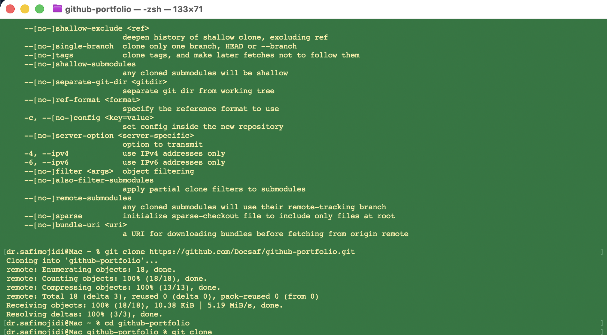

# Lab 01: Infrastructure Audit
**Name:** [Dr. Safi]
**Date:** [01/26/2026]
**Status:** In Progress

## 🎯 Objective
To document the 2021 Facebook outage and practice using GitHub for enterprise documentation.

## 🛠️ Tools Used
* **Git Bash:** For version control.
* **VS Code:** For editing Markdown files.
* **GitHub:** For hosting the repository.

## 🔍 Key Findings (Case Study)
1.  **The Event:** Facebook (Meta) disappeared from the internet because of a configuration error.
2.  **The Technical Cause:** A bad command deleted the BGP (Border Gateway Protocol) routes.
3.  **The Impact:** DNS resolvers could not find Facebook's servers, causing a global blackout.

## 💡 Lessons Learned
I learned that **Configuration Management** is critical. In the future, automated checks should be in place to prevent a single bad command from taking down an entire network.

## 📸 Proof of Work
*(We will add a screenshot here in the next step)*
